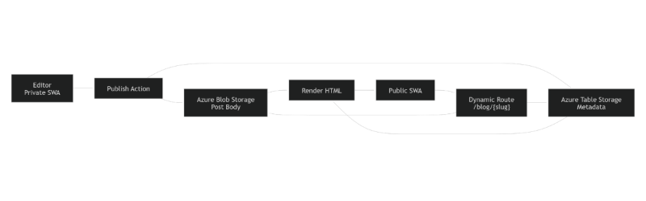

Nice one — this is a solid architecture, and it translates very cleanly into user stories. I’ll do three things **right now**:

1. Turn the document into **well‑formed user stories**
2. Add **clear acceptance criteria** (testable, BA/QA‑friendly)
3. Give you a **copy‑paste‑ready diagram** you can import into **draw\.io** (via Mermaid)

Everything below is derived directly from [publishing-flow.md](https://365evergreen-my.sharepoint.com/personal/paul_365evergreen_com/Documents/Microsoft%20Copilot%20Chat%20Files/publishing-flow.md?EntityRepresentationId=1a6a86d0-5a1e-4223-b863-c0e2b7d82c94). [\[365evergre...epoint.com\]](https://365evergreen-my.sharepoint.com/personal/paul_365evergreen_com/Documents/Microsoft%20Copilot%20Chat%20Files/publishing-flow.md)

***

## 1️⃣ Epic Overview

**Epic:** Content publishing from Private SWA to Public SWA using Blob + Table Storage

**Goal:**\
Enable editors to publish content from a private Static Web App (SWA) to a public SWA without generating static pages, using Blob Storage for content and Azure Table Storage for metadata, while keeping the public site fast, scalable, and SEO‑friendly. [\[365evergre...epoint.com\]](https://365evergreen-my.sharepoint.com/personal/paul_365evergreen_com/Documents/Microsoft%20Copilot%20Chat%20Files/publishing-flow.md)

***

## 2️⃣ User Stories with Acceptance Criteria

### 🧑‍💻 User Story 1: Write content in the private editor

**As an** Editor\
**I want** to write and edit blog posts in a private Static Web App\
**So that** content can be safely prepared before being published publicly [\[365evergre...epoint.com\]](https://365evergreen-my.sharepoint.com/personal/paul_365evergreen_com/Documents/Microsoft%20Copilot%20Chat%20Files/publishing-flow.md)

#### ✅ Acceptance Criteria

* Editor can create a new blog post in the private SWA
* Editor can edit title, body, excerpt, tags, categories, and featured image
* Draft content is **not publicly accessible**
* Drafts can be saved without publishing
* Only authenticated users can access the editor

***

### 🚀 User Story 2: Publish a post

**As an** Editor\
**I want** to publish a blog post\
**So that** it becomes visible on the public website [\[365evergre...epoint.com\]](https://365evergreen-my.sharepoint.com/personal/paul_365evergreen_com/Documents/Microsoft%20Copilot%20Chat%20Files/publishing-flow.md)

#### ✅ Acceptance Criteria

* A “Publish” action exists in the private SWA
* On publish:
  * Post body is rendered to **JSON or Markdown**
  * The rendered file is written to the **public blob container**
  * Metadata is written to **Azure Table Storage**
* Publishing overwrites existing content if the slug already exists
* Publishing fails gracefully with an error if storage is unavailable

***

### 🗂️ User Story 3: Store post body in Blob Storage

**As a** System\
**I want** blog post bodies stored in Azure Blob Storage\
**So that** content is cheap, scalable, and CDN‑cacheable [\[365evergre...epoint.com\]](https://365evergreen-my.sharepoint.com/personal/paul_365evergreen_com/Documents/Microsoft%20Copilot%20Chat%20Files/publishing-flow.md)

#### ✅ Acceptance Criteria

* Post bodies are stored at `/posts/{slug}.json` or `/posts/{slug}.md`
* Blob container allows **public read** access
* Only the private SWA has **write permissions**
* Updating a post replaces the existing blob
* Media assets are stored separately under `/media/{guid}`

***

### 🏷️ User Story 4: Store metadata in Table Storage

**As a** System\
**I want** blog metadata stored in Azure Table Storage\
**So that** posts can be queried efficiently for archives, tags, and categories [\[365evergre...epoint.com\]](https://365evergreen-my.sharepoint.com/personal/paul_365evergreen_com/Documents/Microsoft%20Copilot%20Chat%20Files/publishing-flow.md)

#### ✅ Acceptance Criteria

* Each post creates or updates a Table Storage entity
* Entity includes:
  * slug (RowKey)
  * title
  * date
  * author
  * tags
  * categories
  * excerpt
  * blobPath
  * featuredImage
* Partitioning supports querying by year or category
* Metadata is updated when a post is republished

***

### 🌐 User Story 5: Render posts dynamically on the public site

**As a** Visitor\
**I want** to view blog posts on the public site via a single dynamic route\
**So that** pages load fast without generating static HTML per post [\[365evergre...epoint.com\]](https://365evergreen-my.sharepoint.com/personal/paul_365evergreen_com/Documents/Microsoft%20Copilot%20Chat%20Files/publishing-flow.md)

#### ✅ Acceptance Criteria

* Public SWA has a route `/blog/{slug}`
* Route rewrites to a single post template page
* Page extracts the slug from the URL
* Page fetches:
  * Post body from Blob Storage
  * Metadata from Table Storage
* Content is rendered as HTML in the browser or via SWA API

***

### 🔍 User Story 6: View archives, tags, and categories

**As a** Visitor\
**I want** to browse posts by date, tag, or category\
**So that** I can discover related content easily [\[365evergre...epoint.com\]](https://365evergreen-my.sharepoint.com/personal/paul_365evergreen_com/Documents/Microsoft%20Copilot%20Chat%20Files/publishing-flow.md)

#### ✅ Acceptance Criteria

* Archive, tag, and category pages exist as single templates
* Pages query Table Storage for matching metadata
* Pages do **not** rely on static page generation
* Results are sorted by publish date
* Pages update automatically when new posts are published

***

### 🔎 User Story 7: SEO‑friendly rendering (optional but recommended)

**As a** Site Owner\
**I want** posts to be SEO‑friendly\
**So that** content is discoverable via search engines [\[365evergre...epoint.com\]](https://365evergreen-my.sharepoint.com/personal/paul_365evergreen_com/Documents/Microsoft%20Copilot%20Chat%20Files/publishing-flow.md)

#### ✅ Acceptance Criteria

* An SWA API endpoint can return **pre‑rendered HTML**
* API accepts a slug as input
* API fetches blob content and metadata
* API returns fully rendered HTML
* Public SWA can switch between client‑side and API rendering

***

## 3️⃣ Process Diagram (draw\.io‑ready)

### ✅ Option A: Mermaid (recommended — draw\.io imports this directly)

***

